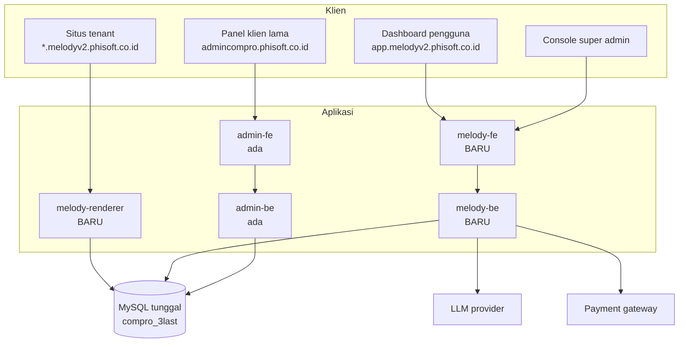
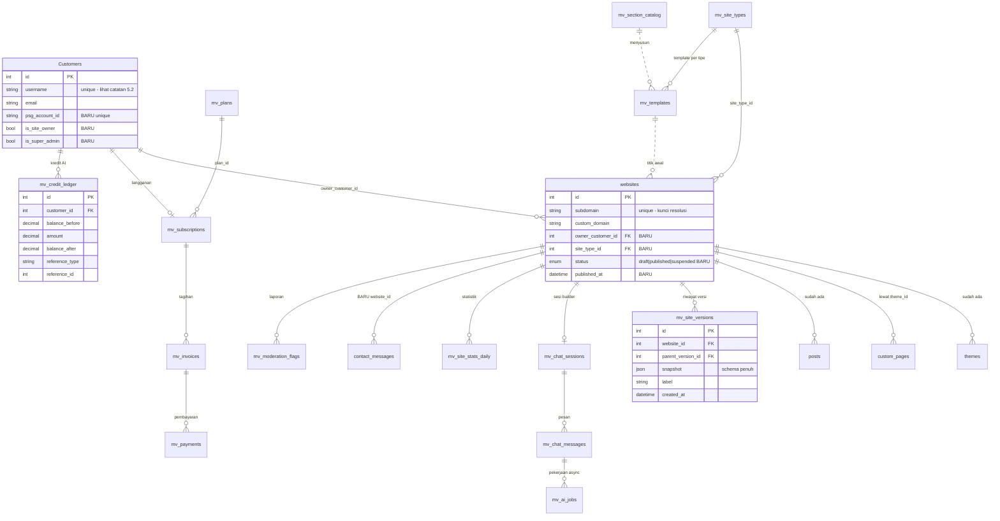
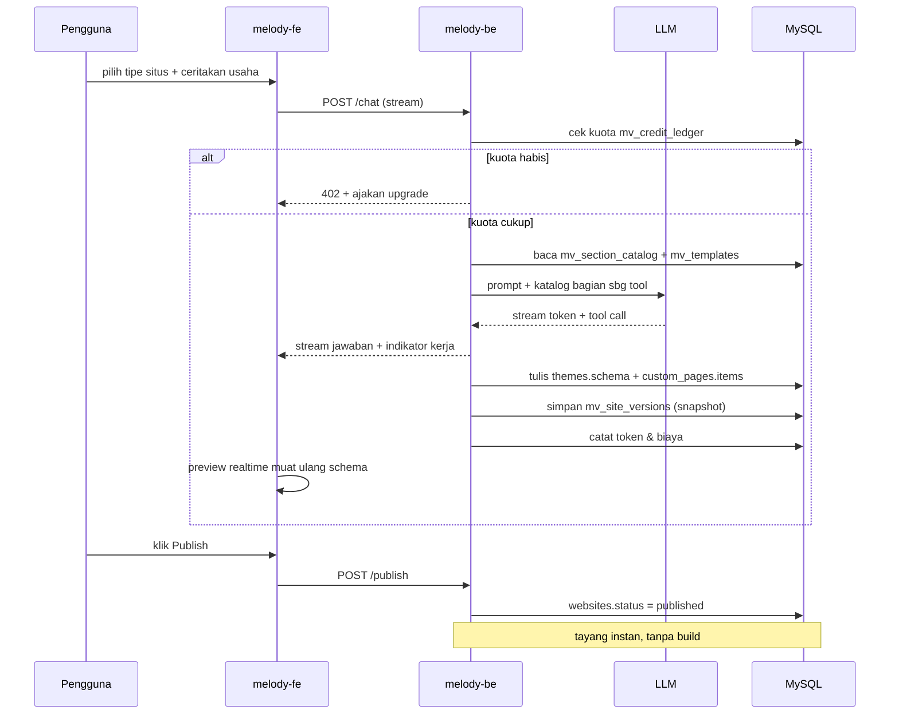
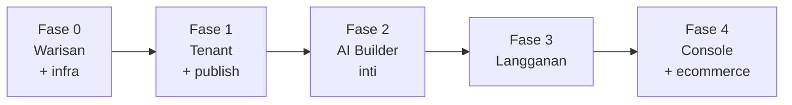

# Arsitektur Target — Melody v2 (Template Generator AI)

> Dokumen **rancangan**. Belum ada kode yang ditulis berdasarkan dokumen ini.
>
> - Kondisi sekarang → [ARSITEKTUR.md](ARSITEKTUR.md)
> - Rancangan tenancy sebelumnya → [ARSITEKTUR-TARGET-MULTITENANT.md](ARSITEKTUR-TARGET-MULTITENANT.md) — sebagian **direvisi** di sini, lihat §4
> - Sumber kebutuhan → *whislist melody v2 template generator.pdf* (19 Agustus 2026)
>
> Cabang `dev-2` · 24 Agustus 2026

---

## Daftar Isi

1. [Keputusan yang mengunci arsitektur](#1-keputusan-yang-mengunci-arsitektur)
2. [Topologi aplikasi](#2-topologi-aplikasi)
3. [Aturan kepemilikan tabel](#3-aturan-kepemilikan-tabel)
4. [Resolusi tenant — revisi](#4-resolusi-tenant--revisi)
5. [Delta pada tabel bersama](#5-delta-pada-tabel-bersama)
6. [Skema baru `mv_*`](#6-skema-baru-mv_)
7. [ERD target](#7-erd-target)
8. [Alur AI Builder](#8-alur-ai-builder)
9. [Peta wishlist → komponen](#9-peta-wishlist--komponen)
10. [Rencana fase](#10-rencana-fase)
11. [Risiko](#11-risiko)
12. [Pertanyaan yang masih terbuka](#12-pertanyaan-yang-masih-terbuka)

---

## 1. Keputusan yang mengunci arsitektur

| # | Aspek | Pilihan | Konsekuensi |
|---|---|---|---|
| 1 | Integrasi | **Satu DB, dua aplikasi** | Tidak ada kontrak API antar sistem. Sebagai gantinya butuh **aturan kepemilikan tabel** yang keras (§3). |
| 2 | Identitas pemilik situs | **Pakai `Customers`** | `Customers` kini melayani 3 peran. Butuh kolom pembeda (§5.2). |
| 3 | Rendering situs tenant | **Runtime schema-driven** | Publish = ubah status, instan. Lanjutan langsung `themes.schema`. |
| 4 | Ecommerce | **Bangun baru di app baru** | Dua skema ecommerce hidup berdampingan di satu database. |

### Ketegangan antara #1 dan #4

Ini titik paling rawan. "Satu database" + "ecommerce baru" berarti tabel `orders` lama (klien compro) dan tabel pesanan Melody duduk di skema yang sama. Tanpa disiplin penamaan, dua codebase akan saling menabrak.

**Aturannya:** seluruh tabel milik Melody v2 berprefix `mv_`. Tidak ada pengecualian, termasuk untuk konsep yang namanya "sudah jelas" seperti `orders` atau `plans`.

---

## 2. Topologi aplikasi

Lima aplikasi, satu database.



| Aplikasi | Status | Tanggung jawab |
|---|---|---|
| `melody-renderer` | baru | Melayani seluruh subdomain tenant. Resolve `Host` → `website_id` → render dari JSON schema. Read-only terhadap DB. |
| `melody-be` | baru | AI builder, chat, versi, langganan, kuota, klaim subdomain, ecommerce Melody, console super admin. |
| `melody-fe` | baru | Dashboard Situs Saya, chat + preview realtime, pengaturan situs, console. |
| `admin-be` | ada | CMS konten, ecommerce lama, wallet, MLM. Melayani klien compro lama. |
| `admin-fe` | ada | Panel admin klien lama. Tidak diarahkan ke tenant Melody. |

`melody-renderer` sengaja dipisah dari `melody-be`: beban bacanya beda kelas (setiap pengunjung setiap tenant), pola cache-nya beda, dan ia tidak butuh akses tulis sama sekali.

---

## 3. Aturan kepemilikan tabel

Konsekuensi paling praktis dari "satu DB, dua aplikasi". Tanpa ini, dua direktori `migrations/` akan menghasilkan skema yang tidak deterministik.

| Golongan | Tabel | Pemilik migration | Boleh dibaca | Boleh ditulis |
|---|---|---|---|---|
| **Bersama** | `websites`, `Customers`, `themes`, `custom_pages`, `posts`, `categories`, `post_categories`, `Media`, `contact_messages` | `admin-be` | keduanya | keduanya |
| **Milik Melody** | seluruh `mv_*` | `melody-be` | keduanya | `melody-be` |
| **Milik lama** | `orders`, `orderdetails`, `orderpayments`, `product_details`, `product_variants*`, `wallet_*`, `topups`, `withdraws`, `adjusts`, seluruh `mlm*`, `Users`, `roles`, `Modules` | `admin-be` | `admin-be` | `admin-be` |

Tiga aturan yang mengikat:

1. **Migration tabel bersama hanya boleh lahir di `admin-be`.** `melody-be` memakai modelnya, tidak pernah membuat migration untuknya.
2. **`melody-be` tidak menyentuh tabel milik lama.** Termasuk tidak membaca `orders` — pesanan tenant Melody ada di `mv_orders`.
3. **Prefix `mv_` wajib** untuk setiap tabel baru Melody, supaya tabrakan nama terdeteksi saat menulis migration, bukan saat runtime.

---

## 4. Resolusi tenant — revisi

Dokumen sebelumnya menyimpulkan "tenant ditentukan dari subdomain, tanpa switcher". Wishlist mengubah kesimpulan itu jadi **dua jalur berbeda**, karena MLD-042 (Dashboard Situs Saya) pada dasarnya memang sebuah pemilih situs.

| Konteks | Cara resolusi | Alasan |
|---|---|---|
| Situs tenant (`melody-renderer`) | `Host` → `websites.subdomain` | Wildcard subdomain membuat `Host` benar-benar bervariasi per tenant. Resolusi dari `Host` jadi **valid** di sini. |
| Dashboard & console (`melody-be`) | Pemilihan eksplisit, divalidasi ke `websites.owner_customer_id` | Dashboard berdiri di satu domain. Satu pengguna punya banyak situs. |
| Panel lama (`admin-be`) | Tidak berubah | Klien compro lama tidak lewat jalur Melody. |

### Kenapa `Host` sekarang valid, padahal di dokumen sebelumnya tidak

Di dokumen sebelumnya, API berdiri di satu hostname (`apicompro.phisoft.co.id`) sehingga `req.headers.host` selalu sama. Sekarang berbeda: `melody-renderer` **memang** menerima request langsung di `store.melodyv2.phisoft.co.id`, jadi `Host` adalah identitas tenant yang sesungguhnya.

```
GET store.melodyv2.phisoft.co.id/
  req.headers.host = 'store.melodyv2.phisoft.co.id'
        ↓ potong sufiks platform
  subdomain = 'store'
        ↓ SELECT id FROM websites WHERE subdomain='store' AND status='published'
  websiteId = 42
```

### Validasi wajib di dashboard

Setiap request `melody-be` yang menyebut `website_id` harus lolos:

```
websites.owner_customer_id === req.customer.id   ATAU   req.customer.is_super_admin
```

Tanpa ini, seorang pengguna cukup mengubah angka di URL untuk menyunting situs orang lain. Ini bukan fase 3 — ini syarat rilis fase 1.

### Prasyarat infrastruktur

- DNS wildcard `*.melodyv2.phisoft.co.id`
- Sertifikat SSL wildcard
- `server_name *.melodyv2.phisoft.co.id` di nginx → `melody-renderer`

---

## 5. Delta pada tabel bersama

### 5.1 `websites`

| Kolom | Tipe | Untuk |
|---|---|---|
| `owner_customer_id` | `INT` FK → `Customers` | MLD-042 kepemilikan situs |
| `site_type_id` | `INT` FK → `mv_site_types` | MLD-008 tipe situs |
| `status` | `ENUM('draft','published','suspended')` | MLD-036 publikasi, MLD-052 suspend |
| `published_at` | `DATETIME` | MLD-036 |
| `custom_domain` | `VARCHAR` unique nullable | MLD-047 domain sendiri pada paket berbayar |
| `is_active` | `BOOLEAN` | MLD-052 |

`subdomain` sudah ada dan menjadi kunci resolusi tenant — perlu dijadikan **unique** dan divalidasi terhadap `mv_reserved_subdomains`.

### 5.2 `Customers`

Setelah keputusan #2, tabel ini melayani tiga peran sekaligus: pembeli toko lama, member MLM, dan pemilik situs Melody. Perlu pembeda eksplisit.

| Kolom | Tipe | Untuk |
|---|---|---|
| `psg_account_id` | `VARCHAR` unique nullable | MLD-005 SSO, auto-link metode login |
| `is_site_owner` | `BOOLEAN` default `false` | Pembeda peran |
| `is_super_admin` | `BOOLEAN` default `false` | MLD-052 |
| `avatar` | `VARCHAR` | MLD-006 |

> **Perhatian.** `Customers.username` bersifat unique dan wajib. Pengguna yang masuk lewat SSO tidak punya username alami — perlu strategi pembangkitan (mis. dari bagian lokal email + sufiks angka bila bentrok). Ini harus diputuskan sebelum migration.
>
> Efek samping lain: `CustomerList.vue` di panel lama akan menampilkan pemilik situs Melody bercampur pembeli toko. Perlu filter `is_site_owner = false`.

### 5.3 `contact_messages`

Tambah `website_id` untuk MLD-023 dan MLD-044 (kotak masuk lintas situs).

### 5.4 `themes` dan `custom_pages`

Tidak berubah strukturnya. `themes.schema` (JSON) dan `custom_pages.items` (JSON) **menjadi format keluaran AI Builder**. Ini alasan kuat memilih rendering schema-driven: formatnya sudah ada dan sudah dipakai.

### 5.5 Blocker yang masih berlaku

Bentrok model `Setting` (dua file mendaftarkan nama model sama, `settings` vs `Settings`) belum selesai. Selama `melody-be` juga akan membaca setelan, ini harus dibereskan lebih dulu. Rinciannya di [ARSITEKTUR-TARGET-MULTITENANT.md §4](ARSITEKTUR-TARGET-MULTITENANT.md).

---

## 6. Skema baru `mv_*`

### 6.1 Tipe situs & katalog

| Tabel | Isi | Wishlist |
|---|---|---|
| `mv_site_types` | company_profile, portfolio, ecommerce. Kolom `allowed_sections` (JSON) menentukan bagian halaman yang tersedia | MLD-008 |
| `mv_section_catalog` | Katalog bagian halaman (Hero, Tentang, Layanan, …) beserta varian tata letak dan skema propertinya | MLD-017, MLD-055 |
| `mv_templates` | Galeri template default per jenis usaha (kuliner, jasa, retail, kesehatan, pendidikan, otomotif) | MLD-012 |

`mv_section_catalog` disimpan sebagai data, bukan kode. Itulah yang membuat MLD-055 ("kelola template tanpa deploy ulang") mungkin.

### 6.2 AI Builder

| Tabel | Isi | Wishlist |
|---|---|---|
| `mv_chat_sessions` | Satu sesi per situs. `website_id`, `customer_id`, status | MLD-009 |
| `mv_chat_messages` | `role`, `content`, `tool_calls` (JSON), `tokens_in`, `tokens_out`, `cost` | MLD-009, MLD-054 |
| `mv_site_versions` | Snapshot JSON penuh tiap perubahan + `label`, `created_by`, `parent_version_id` | MLD-013 |
| `mv_ai_jobs` | Pekerjaan async: cari foto stock, buat gambar. `status`, `payload`, `result` | MLD-020, MLD-021 |
| `mv_ai_suggestions` | Saran proaktif yang belum ditindaklanjuti | MLD-016 |
| `mv_ai_config` | Model, effort, system prompt — dapat disunting dari console | MLD-057 |

`mv_site_versions` menyimpan snapshot penuh, bukan diff. Alasannya MLD-013 menuntut "membandingkan dan mengembalikan" — snapshot penuh membuat pemulihan jadi satu operasi tulis, dan ukurannya masih wajar karena isinya JSON schema, bukan aset.

### 6.3 Subdomain & publikasi

| Tabel | Isi | Wishlist |
|---|---|---|
| `mv_reserved_subdomains` | Kata terlarang + nama sistem (`www`, `api`, `admin`, `app`, …) | MLD-035, MLD-056 |

### 6.4 Langganan & kuota

| Tabel | Isi | Wishlist |
|---|---|---|
| `mv_plans` | Gratis / Pro / Bisnis. `limits` (JSON): jumlah situs, kuota pesan AI, penyimpanan, domain sendiri, riwayat versi | MLD-047 |
| `mv_subscriptions` | `customer_id`, `plan_id`, `status`, periode, `trial_ends_at` | MLD-047 |
| `mv_invoices` | Nomor, jumlah, status, tanggal | MLD-049 |
| `mv_payments` | Gateway, `external_id`, payload webhook mentah | MLD-048 |
| `mv_credit_ledger` | Ledger kredit AI: `balance_before`, `amount`, `balance_after`, `reference_type`, `reference_id` | MLD-015, MLD-050 |
| `mv_usage_daily` | Agregat token & biaya per pengguna per hari | MLD-054 |

> **Kenapa ledger kredit baru, bukan `wallet_histories` yang sudah ada?**
> Ledger lama memakai `username` (string) sebagai kunci relasi dan sudah terikat erat ke MLM serta topup/withdraw. Menumpangkan kredit AI di sana akan mencampur dua domain uang yang berbeda dan mewarisi ketergantungan pada username yang tidak boleh berubah. Polanya ditiru, tabelnya baru.

### 6.5 Dashboard & moderasi

| Tabel | Isi | Wishlist |
|---|---|---|
| `mv_site_stats_daily` | Kunjungan, halaman terpopuler, asal, perangkat — agregat harian per situs | MLD-043 |
| `mv_moderation_flags` | Penandaan otomatis + laporan pengunjung, antrean tinjauan | MLD-053 |

---

## 7. ERD target



Tabel ecommerce Melody (`mv_products`, `mv_orders`, `mv_order_items`, `mv_promo_codes`, …) sengaja tidak digambar — bentuknya menyusul setelah bagian D masuk fase pengerjaan.

---

## 8. Alur AI Builder



Dua hal yang membuat alur ini bekerja:

- **Katalog bagian halaman diberikan ke AI sebagai daftar tool**, bukan sebagai teks bebas. AI memilih dari `mv_section_catalog`, sehingga keluarannya selalu berupa schema yang bisa dirender.
- **Publish tidak memicu build.** Karena rendering schema-driven, publikasi hanya mengubah satu kolom status.

---

## 9. Peta wishlist → komponen

| Bagian | Item | Komponen utama | Catatan |
|---|---|---|---|
| A. Autentikasi | MLD-005, 006 | `Customers` + SSO OIDC | Butuh PSG Account sudah jadi OIDC provider |
| B. AI Builder | MLD-008…016 | `melody-be` + `mv_chat_*`, `mv_site_versions` | Fitur inti |
| C. Konten & tampilan | MLD-017…026 | `themes.schema`, `custom_pages`, `Media`, `posts` | Sebagian besar pakai ulang |
| D. Ecommerce | MLD-027…034 | `mv_*` baru di `melody-be` | Tidak memakai `orders` lama |
| E. Subdomain | MLD-035, 036 | `websites.subdomain` + `mv_reserved_subdomains` | Butuh wildcard DNS/SSL |
| F. Dashboard | MLD-042…046 | `melody-fe` + `mv_site_stats_daily` | MLD-042 adalah pemilih situs |
| G. Langganan | MLD-047…051 | `mv_plans`, `mv_subscriptions`, `mv_credit_ledger` | Ledger baru, bukan wallet lama |
| H. Super Admin | MLD-052…057 | Console di `melody-fe` | `mv_ai_config` bikin model & prompt dapat disunting |

### Nomor yang tidak ada di PDF

`MLD-001` s/d `004`, `007`, `014`, `028`, dan `037` s/d `041` tidak muncul. Perlu dipastikan apakah memang dihapus atau ada di versi dokumen yang lebih lengkap — khususnya `037–041` yang jatuh tepat di antara bagian E (Subdomain) dan F (Dashboard), posisi yang biasanya diisi hal seperti SEO, sitemap, analytics, atau domain kustom.

---

## 10. Rencana fase

### Fase 0 — Bereskan warisan

Sebelum menambah apa pun.

1. Selesaikan bentrok model `Setting`
2. Tetapkan aturan kepemilikan tabel §3 secara tertulis di kedua repo
3. Wildcard DNS + SSL + `server_name` nginx

### Fase 1 — Fondasi tenant

4. Migration `websites`: `owner_customer_id`, `site_type_id`, `status`, `published_at`, `subdomain` unique
5. Migration `Customers`: `psg_account_id`, `is_site_owner`, `is_super_admin`, `avatar`
6. `mv_site_types`, `mv_reserved_subdomains`
7. `melody-be` kerangka + auth (SSO atau lokal) + validasi kepemilikan §4
8. `melody-renderer` resolve `Host` → render `themes.schema`
9. Klaim subdomain + publish/unpublish (MLD-035, 036)

**Hasil:** situs bisa dibuat manual, diberi subdomain, dan tayang. Belum ada AI.

### Fase 2 — AI Builder

10. `mv_section_catalog`, `mv_templates` + seeder katalog bagian halaman
11. `mv_chat_sessions`, `mv_chat_messages`, `mv_site_versions`
12. Endpoint chat streaming + tool call ke katalog
13. Preview realtime berdampingan (MLD-010)
14. Riwayat versi & pemulihan (MLD-013)

**Hasil:** fitur inti jalan. Belum ada monetisasi.

### Fase 3 — Langganan & kuota

15. `mv_plans`, `mv_subscriptions`, `mv_credit_ledger`, `mv_invoices`, `mv_payments`
16. Payment gateway + webhook
17. Indikator kuota + ajakan upgrade (MLD-015)

### Fase 4 — Console & ecommerce

18. Console super admin (MLD-052…057)
19. Ecommerce `mv_*` (bagian D)



---

## 11. Risiko

**Dua direktori migration, satu skema.** Risiko terbesar dari keputusan #1. Mitigasi ada di §3, tapi mitigasinya berupa disiplin manusia, bukan penegakan teknis. Pertimbangkan menambahkan pemeriksaan di CI yang menolak migration `melody-be` yang menyentuh tabel di luar `mv_*`.

**`Customers` melayani tiga peran.** Pemilik situs, pembeli toko, dan member MLM di satu tabel. Query lama yang mengasumsikan "semua Customer adalah pembeli" akan salah hitung. Perlu audit setiap `Customer.findAll` di `admin-be`.

**`Customers.username` unique dan wajib.** Belum ada strategi untuk pengguna SSO. Harus diputuskan sebelum migration fase 1.

**Dua implementasi ecommerce.** `orders` lama dan `mv_orders` baru akan lama hidup berdampingan. Perlu kejelasan kapan yang lama pensiun — atau keputusan sadar bahwa ia tidak pernah pensiun.

**Rendering runtime butuh cache sejak awal.** Setiap pengunjung setiap tenant memicu query schema. Tanpa cache di `melody-renderer`, satu tenant viral bisa menjatuhkan seluruh platform.

**Biaya AI tidak berbatas secara alami.** MLD-054 memantau, tapi pemantauan bukan pembatasan. Perlu hard limit per pengguna per hari yang berlaku bahkan saat kuota berbayar masih ada.

**Moderasi adalah kewajiban, bukan fitur.** Situs publik yang dibuat pengguna anonim di subdomain perusahaan membawa risiko penyalahgunaan. MLD-053 sebaiknya masuk fase 1, bukan fase 4.

---

## 12. Pertanyaan yang masih terbuka

| # | Pertanyaan | Kenapa perlu dijawab sebelum kode |
|---|---|---|
| 1 | Stack `melody-be` / `melody-fe` — lanjut Express + Vue 3, atau pindah (Nest/Fastify, Nuxt/Next)? | Streaming SSE dan preview realtime lebih ringan di sebagian stack. Menentukan struktur repo. |
| 2 | LLM provider & model? | Menentukan bentuk `mv_ai_config`, cara menghitung token, dan format tool call. |
| 3 | Strategi `username` untuk pengguna SSO? | Memblokir migration `Customers` di fase 1. |
| 4 | PSG Account sudah jadi OIDC provider, atau perlu dibangun juga? | Kalau belum, fase 1 butuh auth lokal sementara. |
| 5 | Payment gateway: Midtrans atau Xendit? | MLD-048 menyebut keduanya. Bentuk webhook berbeda. |
| 6 | Statistik pengunjung: bangun sendiri atau pihak ketiga? | Menentukan apakah `mv_site_stats_daily` perlu ada. |
| 7 | MLD-037…041 dan 001…004 — memang tidak ada? | Bisa jadi ada kebutuhan yang belum terpetakan. |
| 8 | `melody-renderer` melayani ecommerce tenant juga, atau tipe ecommerce pakai SPA sendiri? | Rendering schema-driven cocok untuk halaman statis; keranjang & checkout butuh state klien. |
