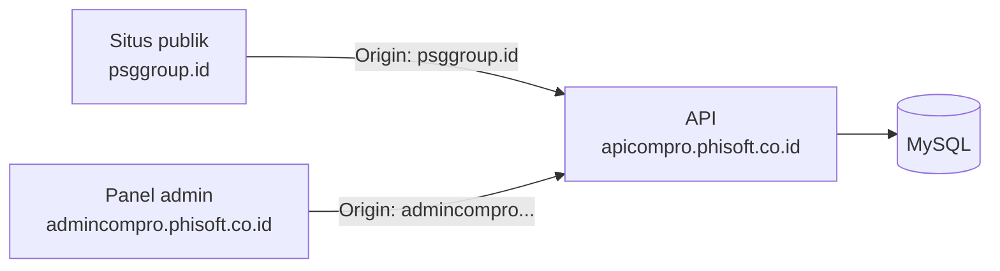
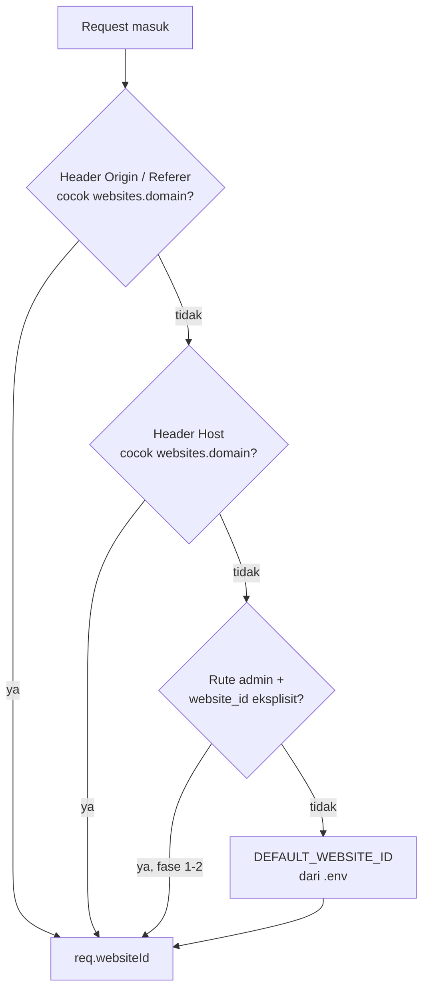
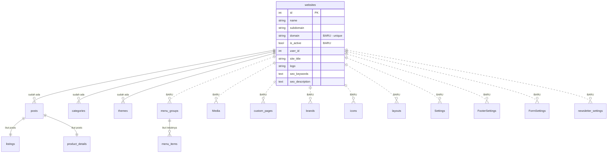
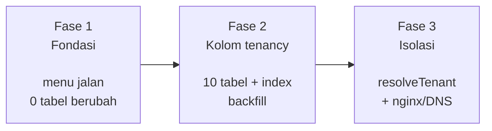

# Arsitektur Target — Multi-tenant Website ID

> Dokumen **rancangan**, bukan potret kondisi sekarang. Untuk kondisi sekarang lihat [ARSITEKTUR.md](ARSITEKTUR.md).
> Belum ada kode yang ditulis berdasarkan dokumen ini.
>
> Cabang `dev-2` · 24 Agustus 2026

---

## Daftar Isi

1. [Keputusan yang diambil](#1-keputusan-yang-diambil)
2. [Titik awal: multi-tenant baru setengah jalan](#2-titik-awal-multi-tenant-baru-setengah-jalan)
3. [Kendala topologi: `Host` tidak bisa mengenali tenant](#3-kendala-topologi-host-tidak-bisa-mengenali-tenant)
4. [Blocker: bentrok model `Setting`](#4-blocker-bentrok-model-setting)
5. [Rantai resolusi tenant](#5-rantai-resolusi-tenant)
6. [Delta skema](#6-delta-skema)
7. [ERD target](#7-erd-target)
8. [Delta backend](#8-delta-backend)
9. [Delta frontend](#9-delta-frontend)
10. [Rencana fase](#10-rencana-fase)
11. [Risiko & keputusan yang masih terbuka](#11-risiko--keputusan-yang-masih-terbuka)

---

## 1. Keputusan yang diambil

| Aspek | Pilihan | Konsekuensi utama |
|---|---|---|
| **Cakupan** | Konten & tampilan | 10 tabel dapat `website_id`. Produk, order, wallet, MLM, listing tetap global. |
| **Penentuan tenant** | Dari subdomain | Backend yang menentukan, bukan frontend. Tidak ada switcher di UI. |
| **Penegakan isolasi** | Bertahap | Fase 1–2 backend percaya parameter; fase 3 backend menegakkan sendiri. |

Ketiganya saling mengunci: karena penentuan lewat subdomain, frontend akhirnya **tidak perlu mengirim `website_id` sama sekali**. Sembilan hardcode `website_id: 1` di frontend bukan diganti switcher — melainkan dihapus, dan backend yang mengisi.

---

## 2. Titik awal: multi-tenant baru setengah jalan

Dari 66 file model (65 nama model unik — lihat [§4](#4-blocker-bentrok-model-setting)), hanya **3 tabel** yang mengenal `website_id`:

```
posts        website_id ✓
categories   website_id ✓
themes       website_id ✓
```

Semua sisanya buta tenant. Dan `Users` tidak punya kolom `website_id`, sehingga saat ini tidak ada satu pun cara sistem mengetahui seorang admin "milik" website mana.

---

## 3. Kendala topologi: `Host` tidak bisa mengenali tenant

Ini yang paling penting dipahami sebelum menulis kode. Topologi produksi sekarang (dari whitelist CORS di `admin-be/server.js`):



API berdiri di **satu hostname**. Artinya untuk setiap request yang masuk:

```
req.headers.host  =  apicompro.phisoft.co.id   ← selalu sama, apa pun tenant-nya
req.headers.origin =  psggroup.id               ← ini yang berbeda per tenant
```

**`Host` adalah nama domain API itu sendiri, bukan domain pemanggil.** Jadi "resolusi dari subdomain" tidak bisa dibaca dari `Host` selama API masih satu hostname. Sinyal yang benar-benar bervariasi per tenant adalah `Origin` — dan kebetulan whitelist CORS sudah mendaftar origin tiap tenant, jadi datanya memang sudah ada.

### Konsekuensi untuk panel admin

Panel admin juga berdiri di satu domain (`admincompro.phisoft.co.id`). Kalau tenant ditentukan dari domain pemanggil, maka **panel admin hanya bisa mengelola satu website** — yaitu website yang dipetakan ke domain admin tersebut.

Supaya satu instalasi admin bisa mengelola banyak website tanpa switcher, panel admin harus ikut disajikan per-tenant:

```
admin.psggroup.id      → tenant psggroup
admin.tenant-lain.id   → tenant lain
```

Ini butuh DNS wildcard, sertifikat SSL wildcard, dan `server_name` di nginx. Selama itu belum siap, panel admin memakai jembatan `website_id` eksplisit — dan itu persis yang dimaksud "bertahap" di fase 1–2.

---

## 4. Blocker: bentrok model `Setting`

Harus dibereskan **sebelum** menambah `website_id`, karena salah satu target penambahan adalah tabel setelan.

`admin-be/models/index.js` memuat model dengan `db[model.name] = model`. Dua file mendaftarkan nama model yang sama:

| File | Nama model | `tableName` |
|---|---|---|
| `models/logoSettings.js` | `Setting` | `settings` |
| `models/setting.js` | `Setting` | `Settings` (default, karena `tableName` tidak diset) |

`logoSettings.js` dimuat lebih dulu secara alfabetis, lalu **ditimpa** oleh `setting.js`. Hasilnya:

```
db.Setting.getTableName()  →  'Settings'
```

Model dengan `tableName: 'settings'` tidak pernah terpakai. Dua controller yang tidak berhubungan — `settingLogoController.js` dan `settingTransaksiController.js` — akhirnya menulis ke **tabel yang sama** dengan kolom `key` datar tanpa namespace, sehingga setelan logo dan setelan transaksi berebut ruang kunci yang sama.

Di macOS ini sering tidak terasa karena MySQL case-insensitive terhadap nama tabel. **Di Linux produksi `settings` dan `Settings` adalah dua tabel berbeda.**

### Yang harus dilakukan lebih dulu

1. Tentukan satu tabel setelan yang benar (`settings`).
2. Pisahkan nama model, misal `Setting` (logo/situs) dan `TransactionSetting`, atau tambahkan kolom `group`.
3. Baru setelah itu tambahkan `website_id` + unique `(website_id, key)`.

---

## 5. Rantai resolusi tenant

Middleware baru `middlewares/resolveTenant.js` mengisi `req.websiteId` dengan urutan prioritas berikut. Yang lebih atas menang.



| Prioritas | Sumber | Berlaku untuk | Aktif di fase |
|---|---|---|---|
| 1 | `Origin` / `Referer` → `websites.domain` | Situs publik | 3 |
| 2 | `Host` → `websites.domain` | API per-tenant hostname (kalau nanti dipakai) | 3 |
| 3 | `website_id` eksplisit di query/body | Rute admin saja | 1–2 (jembatan) |
| 4 | `DEFAULT_WEBSITE_ID` dari `.env` | Fallback | semua |

Langkah 3 sengaja **dibatasi hanya untuk rute admin** dan dimatikan di fase 3. Kalau dibiarkan hidup, isolasi apa pun bisa dilewati cukup dengan menambah `?website_id=` di URL.

---

## 6. Delta skema

### 6.1 Kolom baru di `websites`

| Kolom | Tipe | Alasan |
|---|---|---|
| `domain` | `VARCHAR` unique | Host lengkap untuk pencocokan `Origin`/`Host`. `subdomain` yang ada sekarang hanya menyimpan potongan (`default`, `psggroup`) sehingga tidak cukup. |
| `is_active` | `BOOLEAN` default `true` | Menonaktifkan tenant tanpa menghapus datanya. |

### 6.2 Tabel yang mendapat `website_id`

Cakupan **konten & tampilan**. Nama tabel di bawah adalah nama sebenarnya di database, bukan nama model.

| Tabel | Model | Catatan |
|---|---|---|
| `menu_groups` | `menu_group` | `menu_items` ikut lewat `menu_group_id`, tidak perlu kolom sendiri |
| `Media` | `Media` | perhatikan huruf besar `M` pada nama tabel |
| `custom_pages` | `CustomPage` | |
| `brands` | `Brand` | |
| `icons` | `Icon` | key/value → butuh unique `(website_id, key)` |
| `layouts` | `Layout` | |
| `Settings` | `Setting` | **tunggu §4 selesai** |
| `FooterSettings` | `FooterSetting` | `tableName` tidak diset, ikut default Sequelize |
| `FormSettings` | `FormSetting` | `tableName` tidak diset |
| `newsletter_settings` | `NewsletterSettings` | |

Total **10 tabel**, ditambah 2 kolom di `websites`.

Setiap kolom `website_id` disertai index. Tanpa index, setiap query yang difilter tenant akan full-scan.

### 6.3 Yang sengaja tetap global

| Kelompok | Tabel | Alasan |
|---|---|---|
| Taksonomi | `post_types`, `product_types`, `listing_types` | Definisi tipe dipakai bersama semua tenant |
| Identitas & izin | `Users`, `roles`, `Modules`, `RoleActiveModules`, `RoleOtherModules`, `role_categories` | Di luar cakupan yang dipilih |
| Referensi | `banks`, `wallet_types`, `transaction_types`, `location` | Data master nasional |
| Commerce | `product_details`, `product_variants*`, `orders`, `orderdetails`, `orderpayments`, `history_order_status` | Di luar cakupan |
| Dompet | `wallet_histories`, `starting_balances`, `topups`, `withdraws`, `adjusts`, `wallet_summaries`, `userdailywallets` | Di luar cakupan |
| MLM | seluruh `mlm*` | Di luar cakupan |
| Listing | `listings`, `listing_values` | Ikut tenant lewat `posts.website_id`, karena `listings.post_id` adalah PK sekaligus FK |
| Customer | `Customers`, `customer_addresses`, `comments` | Di luar cakupan |

> **Catatan.** `product_details` ikut tenant secara tidak langsung lewat `posts.website_id` (relasi 1:1). Tapi `orders` tidak punya jalur apa pun ke `websites` — kalau nanti butuh order per-tenant, itu perubahan cakupan, bukan penambahan kolom biasa.

---

## 7. ERD target

Garis putus-putus = relasi yang **ditambahkan** dokumen ini.



---

## 8. Delta backend

### 8.1 File baru

| File | Fase | Isi |
|---|---|---|
| `middlewares/resolveTenant.js` | 3 | Rantai resolusi §5, mengisi `req.websiteId`. Cache pemetaan domain→id di memori. |
| `middlewares/tenantScope.js` | 3 | Helper `scoped(where, req)` yang menyisipkan `website_id`, dipakai controller yang tabelnya sudah tenant-aware. |
| `migrations/*-add-website-id-*.js` | 2 | 10 migration kolom + index + backfill ke `DEFAULT_WEBSITE_ID`. |
| `migrations/*-add-domain-to-websites.js` | 1 | Kolom `domain` + `is_active`. |

### 8.2 File yang berubah

| File | Perubahan |
|---|---|
| `server.js` | Pasang `resolveTenant` sebelum semua route. Perbaiki urutan mount — lihat §11. |
| `controllers/websiteController.js` | Whitelist kolom yang boleh ditulis; tolak hapus website yang masih punya konten; validasi `domain` unik. |
| `routes/websiteRoutes.js` | `requireAuth` pada POST/PUT/DELETE (lihat §11). |
| `models/setting.js`, `models/logoSettings.js` | Selesaikan bentrok §4. |
| 10 controller pemilik tabel di §6.2 | Terima & simpan `website_id`; fase 3 filter otomatis. |

---

## 9. Delta frontend

Karena tenant ditentukan backend, sisi frontend justru **menyusut**, bukan bertambah.

### 9.1 Menu baru

```
Sidebar → Setting
           ├ Site Setting     (sudah ada)
           └ Website          ← BARU
```

| Rute | Komponen | Isi |
|---|---|---|
| `/admin/websites` | `views/website/WebsiteList.vue` | Tabel: ID, Nama, Subdomain, Domain, Judul Situs, Tema Aktif, Status |
| `/admin/websites/create` | `views/website/WebsiteForm.vue` | Form 13 kolom, dikelompokkan Identitas / Tampilan / SEO / Lainnya |
| `/admin/websites/:id` | `views/website/WebsiteForm.vue` | idem, mode edit |

### 9.2 Yang dihapus di fase 3

Sembilan hardcode `website_id: 1` **dihapus**, tidak diganti store:

```
views/posts/PostForm.vue              website_id: 1
views/products/ProductForm.vue        website_id: 1
views/testimonial/TestimonialForm.vue website_id: 1
views/pages/PageForm.vue              website_id: 1
views/listing/ListingForm.vue         website_id: 1
views/pages/CustomPageForm.vue        websiteId = 1
components/theme/AdminTheme.vue       websiteId = 1
components/theme/SchemaEditor.vue     websiteId = 1
views/pengaturan/SiteSetting.vue      websiteId: 1
```

State `websiteId` di `src/store/index.js` beserta action `fetchWebsiteIdFromServer` juga dihapus — sekarang tidak terpakai siapa pun, dan di arsitektur ini memang tidak akan pernah terpakai.

---

## 10. Rencana fase

### Fase 1 — Fondasi

Belum ada perubahan perilaku tenant. Tujuannya menu Website bisa dipakai.

1. Selesaikan bentrok model `Setting` (§4)
2. Migration `websites.domain` + `websites.is_active`
3. Perkuat `websiteController` — whitelist kolom, validasi domain unik, cegah hapus website berisi konten
4. `requireAuth` pada POST/PUT/DELETE `websiteRoutes`
5. Frontend: menu, `WebsiteList.vue`, `WebsiteForm.vue`, 3 rute

**Hasil:** master data website bisa dikelola. Semua konten masih jatuh ke website default.

### Fase 2 — Kolom tenancy

6. 10 migration `website_id` + index
7. Backfill semua baris lama ke `DEFAULT_WEBSITE_ID`
8. 10 controller menerima dan menyimpan `website_id`

**Hasil:** data sudah bertanda tenant. Backend masih percaya parameter dari frontend — **belum ada isolasi**.

### Fase 3 — Isolasi

9. `resolveTenant` + `tenantScope`
10. Matikan jalur `website_id` eksplisit
11. Hapus 9 hardcode frontend + state Vuex
12. Audit tiap query di 10 controller
13. DNS wildcard + SSL + `server_name` nginx untuk `admin.<tenant>`

**Hasil:** tenant ditentukan backend, tidak bisa dilewati dari sisi klien.



---

## 11. Risiko & keputusan yang masih terbuka

### Perlu diputuskan

| # | Pertanyaan | Kenapa penting |
|---|---|---|
| 1 | Panel admin akan disajikan per-tenant (`admin.<tenant>.id`) atau tetap satu domain? | Kalau tetap satu domain, "tanpa switcher" berarti satu instalasi admin = satu website. Fase 3 tidak bisa selesai tanpa keputusan ini. |
| 2 | `GET /api/admin/websites` dan `GET /:id` mau ditutup? | Sekarang terbuka tanpa auth dan `GET /:id` membocorkan `admin_email`. Saya belum tahu apakah frontend publik memanggilnya. |
| 3 | Website default untuk data lama — id `1`? | Menentukan isi backfill fase 2. |
| 4 | Setelan transaksi mau pindah tabel sendiri atau tetap satu tabel dengan kolom `group`? | Menentukan bentuk perbaikan §4. |

### Risiko

**Urutan mount route.** `/api/admin/websites` di-mount **di atas** `app.use('/api', requireAuth)` di `server.js`, jadi seluruh CRUD-nya publik. Tapi mount-nya tidak bisa asal dipindah ke bawah — router yang sama memuat `/public/:id/settings` yang memang harus terbuka. Perbaikannya pasang `requireAuth` per-route, bukan pindah mount.

**Backfill tidak bisa dibatalkan otomatis.** Setelah 10 tabel diisi `website_id = 1`, memisahkan data ke tenant berbeda harus manual.

**Tabel `Media` dan `Settings` berhuruf besar.** Aman di macOS, berbeda di Linux. Tulis nama tabel persis di migration.

**Fase 2 tanpa fase 3 memberi rasa aman palsu.** Data sudah bertanda tenant tapi siapa pun bisa mengubah `website_id` lewat parameter. Jangan diperlakukan sebagai isolasi sampai fase 3 selesai.

**`orders` tidak punya jalur ke `websites`.** Kalau order per-tenant ternyata dibutuhkan, itu perluasan cakupan — bukan sekadar tambah kolom, karena `orders` juga belum punya asosiasi ke `Customers`.
