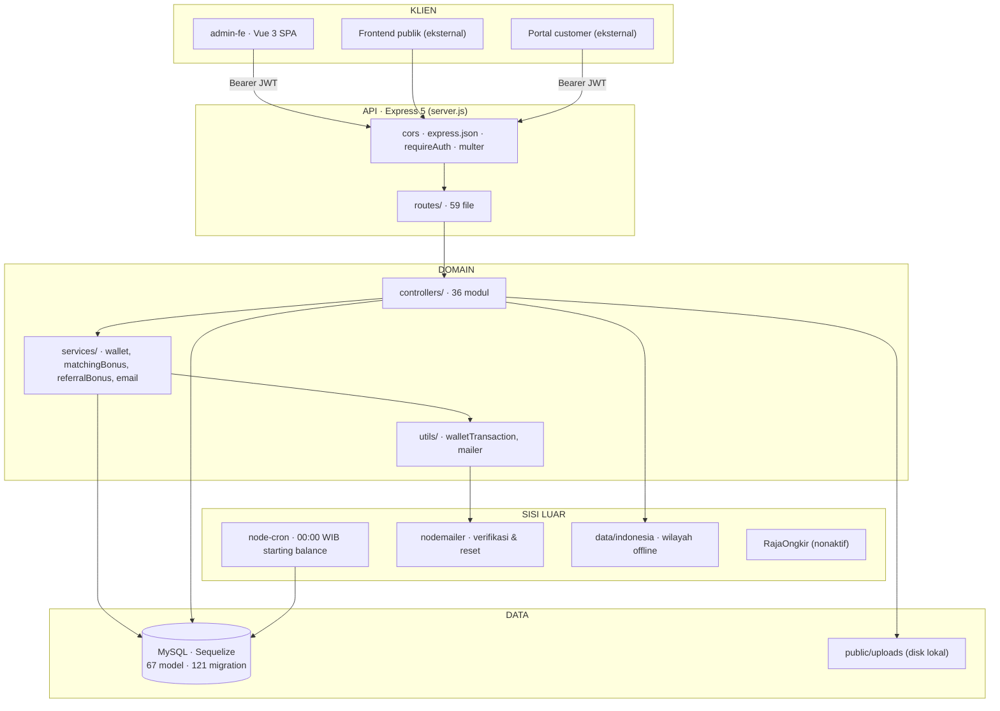
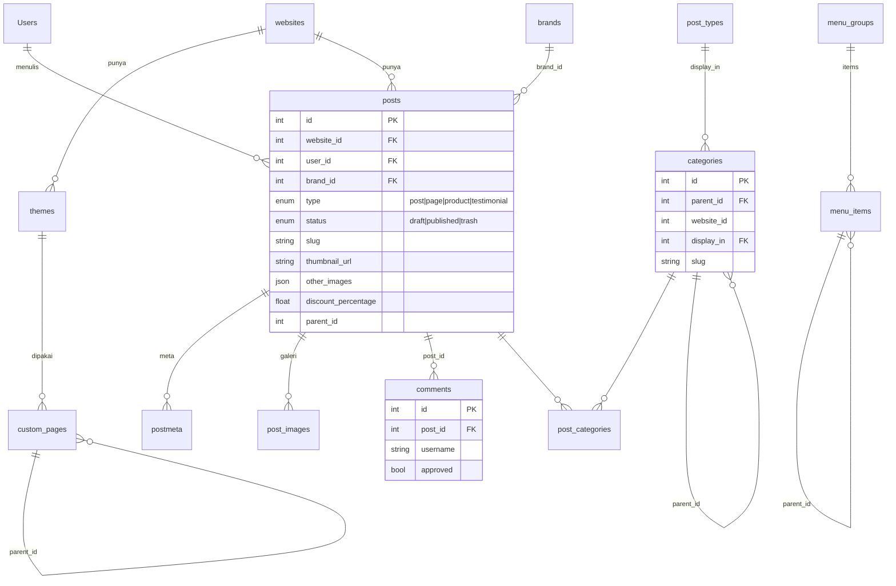
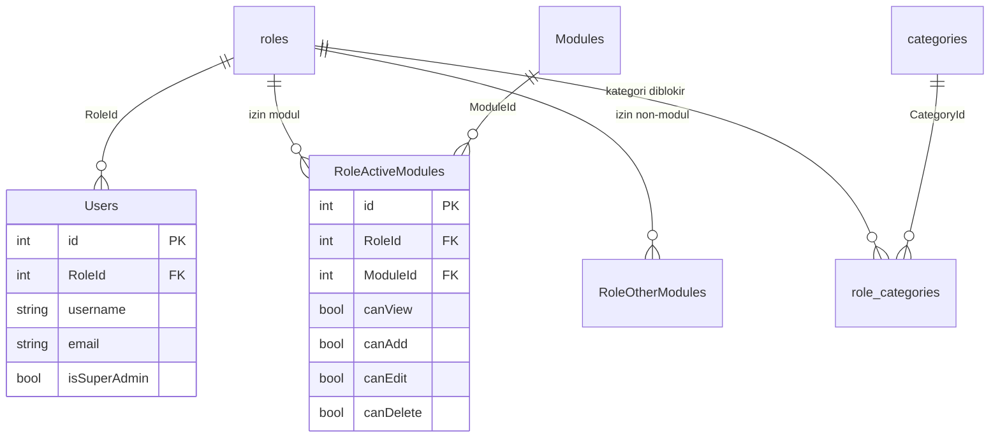
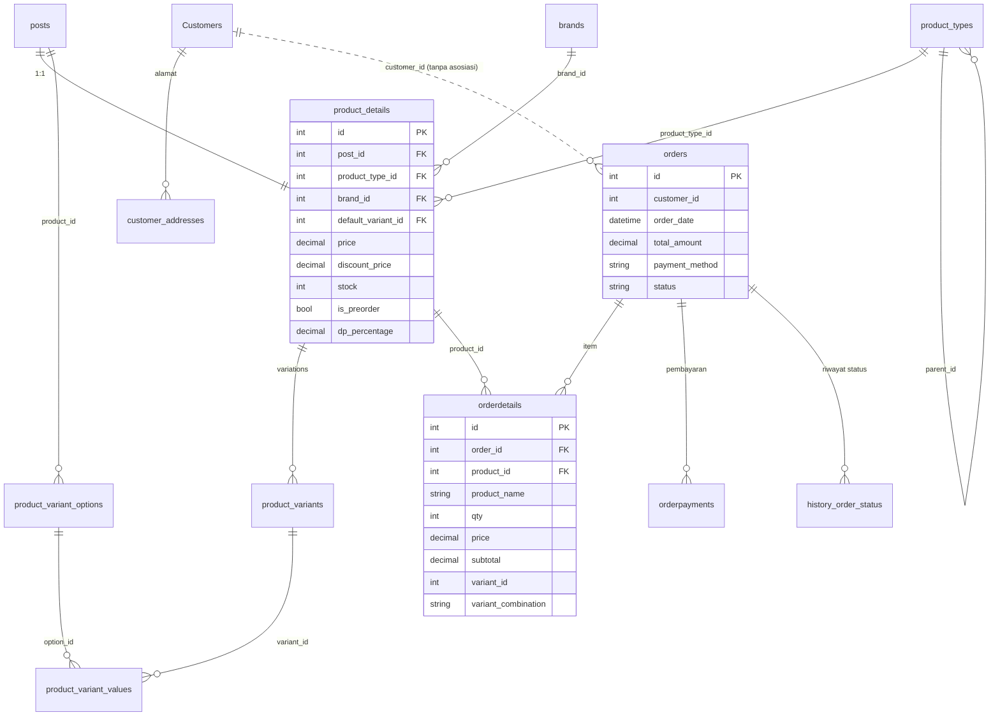
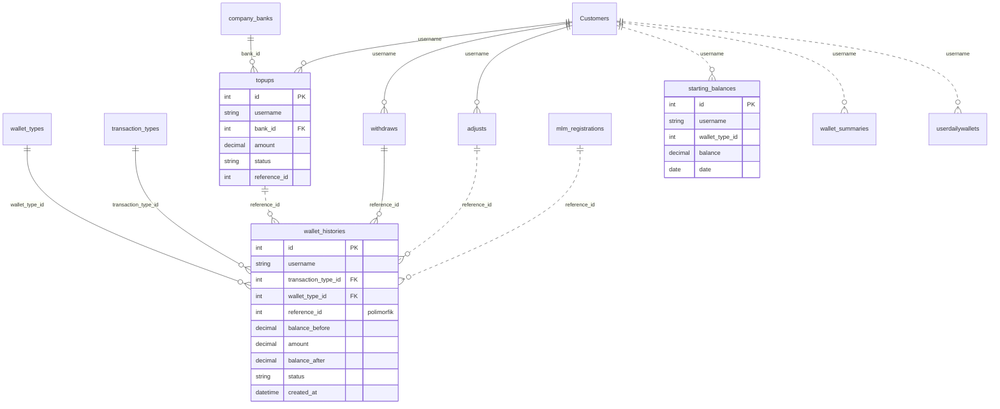
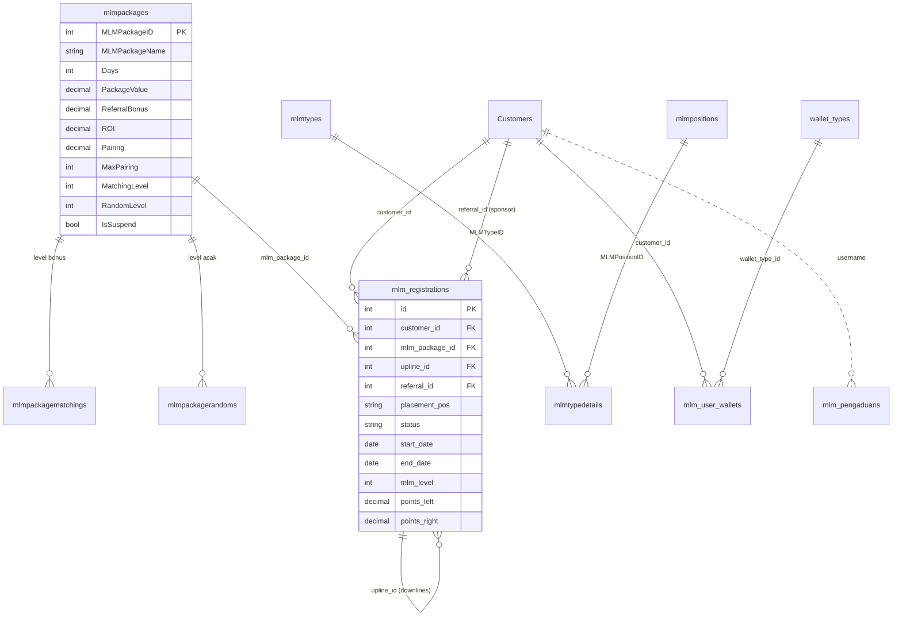
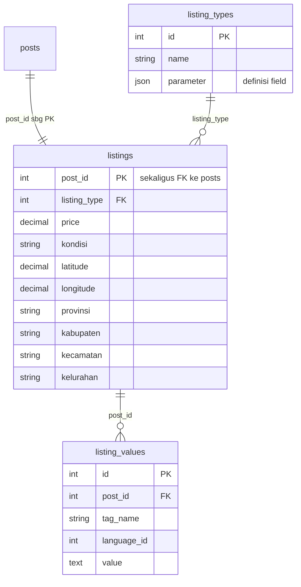

# Arsitektur Meolody CMS

> Peta lengkap sistem: dua aplikasi terpisah (Vue 3 admin panel dan Express API), satu database MySQL, dan enam domain data yang berbagi satu tabel pusat — `posts`.
>
> Disusun dari pembacaan langsung `admin-be/models` (67 model), `admin-be/server.js`, `admin-be/routes` (59 file), dan `admin-fe/src/router`.
> Cabang `dev-2`, commit `1ac00ed98` · 21 Agustus 2026

| | |
|---|---|
| Model Sequelize | **67** |
| File route | **59** |
| Domain data | **6** |
| Realm autentikasi | **2** |

---

## Daftar Isi

1. [Gambaran umum](#1-gambaran-umum)
2. [Arsitektur runtime](#2-arsitektur-runtime)
3. [Lapisan backend](#3-lapisan-backend)
4. [Autentikasi & hak akses](#4-autentikasi--hak-akses)
5. [Enam domain data](#5-enam-domain-data)
6. [ERD 1 · Konten & multi-tenant](#6-erd-1--konten--multi-tenant)
7. [ERD 2 · RBAC admin](#7-erd-2--rbac-admin)
8. [ERD 3 · Produk, varian, dan order](#8-erd-3--produk-varian-dan-order)
9. [ERD 4 · Dompet & transaksi](#9-erd-4--dompet--transaksi)
10. [ERD 5 · Jaringan MLM](#10-erd-5--jaringan-mlm)
11. [ERD 6 · Listing (EAV)](#11-erd-6--listing-eav)
12. [Catatan skema](#12-catatan-skema)

---

## 1. Gambaran umum

Repositori ini berisi dua proyek yang berdiri sendiri dan hanya bertemu lewat HTTP:

- **`admin-fe`** — Vue 3 (Vue CLI) SPA. Pinia + Vuex berdampingan, Vue Router dengan ±60 rute, Tailwind, dan tiga editor rich-text sekaligus (EditorJS, TipTap, Quill). Base URL API datang dari `VUE_APP_API_URL` dan seluruh endpoint dipusatkan di `admin-fe/src/config/`.
- **`admin-be`** — Express 5 + Sequelize 6 + MySQL. Tidak ada TypeScript, tidak ada layer ORM tambahan; controller memanggil model langsung.

Produknya sendiri adalah CMS multi-tenant yang tumbuh jauh melewati "CMS": di atas fondasi konten ada e-commerce lengkap, sistem dompet/ledger, jaringan MLM binary, dan modul listing properti/kendaraan.

---

## 2. Arsitektur runtime



**Alur singkat:** Token JWT disimpan di `localStorage`, dikirim sebagai `Authorization: Bearer`. Semua route dimount di `admin-be/server.js`. Batas proteksi ada di satu baris: `app.use('/api', requireAuth)` — route yang dimount sebelumnya bersifat publik.

Timezone dipaksa `Asia/Jakarta` di proses dan di koneksi (`+07:00`, `dateStrings: true`). `sequelize.sync()` dinonaktifkan — skema sepenuhnya dikendalikan migration.

### Environment

CORS whitelist bercabang tiga di `admin-be/server.js`:

| Mode | Origin yang diizinkan |
|---|---|
| `production` | psggroup.id, office.psggroup.id, admincompro.phisoft.co.id, apicompro.phisoft.co.id |
| `staging` | compro.pasifiksgroup.com:8443 |
| `development` | localhost:5173, 8080–8084, 1234 |

Frontend punya lima mode build: `sandbox`, `production`, `staging`, `psggroup`, plus default.

---

## 3. Lapisan backend

Tidak ada repository layer. Controller melakukan query Sequelize langsung; `services/` hanya dipakai untuk logika yang benar-benar lintas-controller (perhitungan saldo dompet, bonus matching & referral MLM, pengiriman email).

```
routes/  →  controllers/  →  models/
              ↓
           services/  →  utils/
```

### Peta prefix route

| Prefix | Untuk siapa | Auth | Isi |
|---|---|---|---|
| `/api/auth` | Admin | Publik | Login, register, forgot/reset password |
| `/api/admin/*` | Admin | JWT + permission modul | User, role, module, order, komentar, custom page, tema, MLM |
| `/api/*` | Admin | JWT (`requireAuth`) | Layout, menu, media, footer, produk, transaksi |
| `/apis/*` | Publik / frontend | Sebagian besar terbuka | Posts, kategori, brand, komentar, ikon, listing, kontak |
| `/customer/*` | Customer | JWT customer | Auth, alamat, order, transaksi, MLM tree & pengaduan |
| `/banks`, `/company-banks` | Campuran | Terbuka | Master bank & rekening perusahaan |

> ⚠️ **Urutan mount menentukan proteksi.** Karena `app.use('/api', requireAuth)` dipanggil di tengah file, semua yang dimount di atasnya — termasuk `/api/admin/mlm-packages`, `/api/admin/roles`, `/api/admin/modules`, `/api/setting-logo`, `/api/company-banks` dan `/api/admin/custom-pages` versi pertama — **tidak melewati `requireAuth`**. Menambah route baru di posisi yang salah akan diam-diam membukanya ke publik.

---

## 4. Autentikasi & hak akses

Sistem punya **dua tabel pengguna yang sama sekali tidak berelasi**:

- **`Users`** — staf admin. Punya `RoleId`, flag `isSuperAdmin`, dijaga `admin-be/middlewares/authMiddleware.js`.
- **`Customers`** — pengguna akhir. Punya verifikasi email, kode reset password, data rekening bank, dan kolom `referral` untuk MLM. Dijaga `admin-be/middlewares/authCustomer.js`.

Setiap request yang lolos `requireAuth` mendapat token baru berumur 2 jam di header respons `x-refreshed-token` — sliding session tanpa refresh-token terpisah.

### Model izin (bertingkat tiga)

1. **Nama role** — `admin` / `super admin` / `superadmin` / `administrator` lolos otomatis.
2. **`RoleActiveModules`** — flag `canView` / `canAdd` / `canEdit` / `canDelete` per modul.
3. **`role_categories`** — memblokir kategori konten tertentu untuk sebuah role.

---

## 5. Enam domain data

| Domain | Tabel inti | Peran |
|---|---|---|
| Konten & tenant | `websites`, `themes`, `posts`, `categories`, `custom_pages`, `menu_*`, `media` | Fondasi CMS multi-situs |
| RBAC admin | `Users`, `roles`, `Modules`, `RoleActiveModules` | Siapa boleh apa di admin panel |
| Produk & order | `product_details`, `product_variants`, `orders`, `orderdetails` | E-commerce di atas `posts` |
| Dompet | `wallet_histories`, `starting_balances`, `topups`, `withdraws` | Ledger saldo customer |
| MLM | `mlmpackages`, `mlm_registrations`, `mlmtypedetails` | Jaringan binary + bonus |
| Listing | `listings`, `listing_types`, `listing_values` | EAV untuk properti/kendaraan |

Yang mengikat semuanya adalah **`posts`**. Kolom `type` bertipe `ENUM('post','page','product','testimonial')`, sehingga satu tabel melayani artikel, halaman statis, produk, dan testimoni sekaligus. Produk memperluasnya lewat `product_details` (1:1), listing lewat `listings` (1:1, dengan `post_id` sebagai primary key).

---

## 6. ERD 1 · Konten & multi-tenant

Tabel pusat `posts` bercabang ke meta, gambar, kategori (many-to-many), dan komentar.



**Tabel setelan yang berdiri sendiri (tanpa relasi):** `settings`, `icons`, `layouts`, `location`, `Media`, `contact_messages`, `newsletter_settings`, `newsletter_subscribers`, dan model setelan berbasis JSON `FooterSetting` serta `FormSetting`.

---

## 7. ERD 2 · RBAC admin



---

## 8. ERD 3 · Produk, varian, dan order

Varian dimodelkan dua kali: sebagai kombinasi konkret (`product_variants`) dan sebagai daftar opsi (`product_variant_options`), dijembatani `product_variant_values`.



---

## 9. ERD 4 · Dompet & transaksi

Ini **ledger**, bukan kolom saldo. Saldo dihitung ulang di `admin-be/services/walletServices.js` sebagai `starting_balance` terakhir + `SUM(amount)` dari `wallet_histories` sesudah tanggal tersebut. Cron harian jam 00:00 WIB memotret ulang `starting_balances` agar penjumlahan tidak makin panjang.

> Perhatikan: seluruh domain ini memakai `username` (string) sebagai kunci relasi, bukan `id`.



Tabel `banks` (master bank nasional) dan `company_banks` (rekening penampung perusahaan) berdiri terpisah — `company_banks` menyimpan `bank_name` sebagai teks, bukan foreign key ke `banks`.

---

## 10. ERD 5 · Jaringan MLM

Pohon binary: setiap `mlm_registrations` punya `upline_id` dan `placement_pos` (kiri/kanan), dengan akumulator `points_left` dan `points_right`. `referral_id` terpisah dari `upline_id` — sponsor dan penempatan tidak harus sama orang.



`mlmsettings` menyimpan parameter global (auto-approve, max child, sumber bonus, daftar posisi & wallet sebagai JSON). `mlmwallets` ada sebagai tabel tapi asosiasinya masih dikomentari di model.

---

## 11. ERD 6 · Listing (EAV)

Modul termuda — migration dan seeder-nya bertanggal November–Desember 2025. Skemanya EAV: `listing_types` mendefinisikan field lewat kolom JSON `parameter`, lalu nilainya disimpan baris-per-baris di `listing_values`, lengkap dengan `language_id` untuk multi-bahasa.



---

## 12. Catatan skema

Temuan berikut murni dari membaca kode — bukan bug yang sudah dikonfirmasi bikin error, tapi tiap-tiap satunya akan menggigit saat ada perubahan.

### Dompet memakai `username`, bukan `id`
Seluruh tabel `wallet_histories`, `starting_balances`, `topups`, `withdraws`, dan `adjusts` memakai string `username` sebagai kunci relasi. Artinya username tidak bisa diubah tanpa memutus riwayat saldo.

### Cron saldo menyapu tabel yang salah
`admin-be/cron/cronStartingBalance.js` mengambil daftar username dari `User` (staf admin), sementara semua transaksi dompet dimiliki `Customer`. Snapshot harian kemungkinan besar tidak menyentuh customer sama sekali.

### `upline_id` punya dua arti
Di `admin-be/models/mlmregistration.js`, `upline_id` dipakai sebagai FK ke `Customers` (alias `upline`) sekaligus sebagai FK ke `mlm_registrations` itu sendiri (alias `downlines`). Hanya salah satu yang bisa benar.

### `orders` tidak punya asosiasi ke `Customers`
Kolom `customer_id` ada, tapi tidak ada `Order.belongsTo(Customer)`. Data customer di order harus di-join manual.

### Alias `Website.hasMany(Post)` bernama `'website'`
Alias tunggal untuk relasi jamak di `admin-be/models/website.js` — `include: { as: 'website' }` akan mengembalikan array, bukan objek.

### `reference_id` bersifat polimorfik tanpa penanda tipe
`wallet_histories.reference_id` menunjuk ke `topups`, `withdraws`, `adjusts`, atau `mlm_registrations` tergantung `transaction_type_id`. Tidak ada kolom tipe eksplisit, sehingga integritasnya bergantung sepenuhnya pada kode.

### Sisa kode mati di root backend
`remote.php`, `seli.php`, dan folder `html/` berisi file PHP dan halaman nginx default yang tidak dipakai Express. `.env` juga ikut ter-commit.
